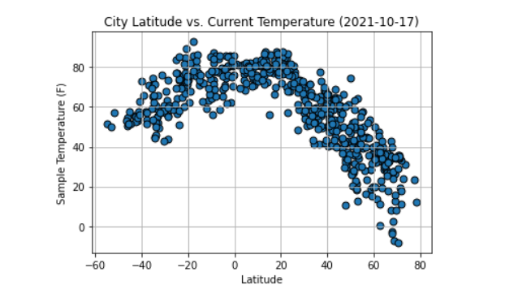

# python-api-challenge
The goal of this challenge was to explore how weather trends changed with changes in latitude. Using a jupyter notebook, a series of API calls were generated for realtime weather data in cities across the globe. That weather data was then aggregated, displayed in dataframes, displayed in scatter plots with linear regression analysis, and displayed on google maps widgets. These operations were accomplished using matplotlib, pandas, numpy, scipy, and google maps in 2 jupyter notebooks as well as the OpenWeatherMap API. 

Here's an example scatterploty generated from the data collected:

*Please Note, the google maps API calls give an error now because the google API key is no longer valid.*  

  ---  
  
Daniel Kogel  
dkogel123@gmail.com  
www.linkedin.com/in/daniel-kogel  

